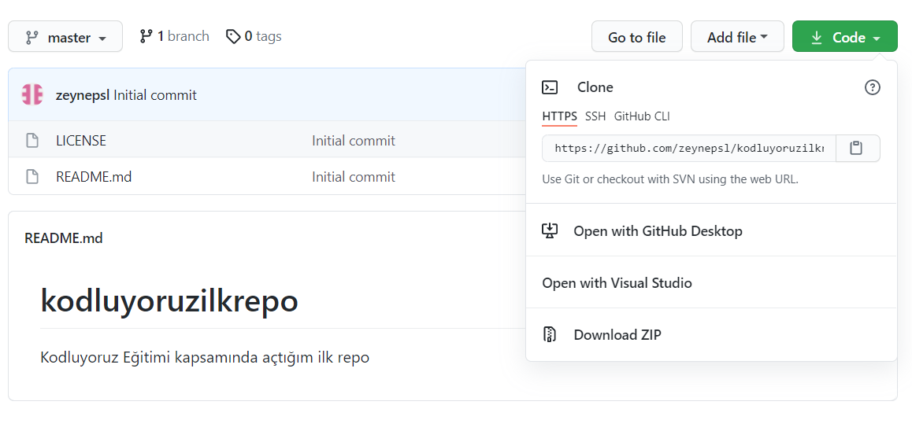

# kodluyoruzilkrepo
Kodluyoruz Eğitimi kapsamında açtığım ilk repo

## Installation

Öncelikle projeyi clone'layın.

```bash
https://github.com/zeynepsl/kodluyoruzilkrepo.git
```



## Usage

Projeyi clone'ladıktan sonra Visual Studio Code programında açınız.

Linux için:

```bash
cd kodluyoruzilkrepo
code .
```

## Contributing

Pull requestler kabul edilir. Büyük değişiklikler için, lütfen önce neyi değiştirmek istediğinizi tartışmak için bir konu açınız.

## Licence

[MIT](https://choosealicense.com/licenses/mit/)


